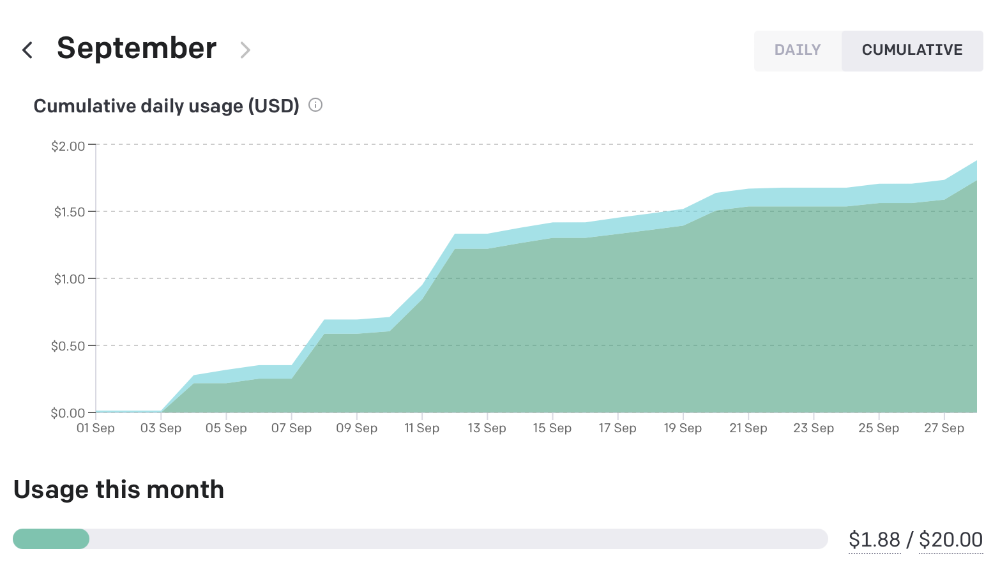

# LocalGPT

Welcome to the LocalGPT repository!
Have your own GPT-4 chat website without paying excessive price of $20+ per
month.

## Table of Contents
1. Introduction
2. Features
3. Installation
4. Usage
5. Contributing
6. License

## Introduction 
This repository contains code and resources related to LocalGPT,
a localized version of chat.openai.com. 

The goal of the project is to create a cost saving alternative to the website
without giving up on the online chatting experience.

## Features

* All chats are saved in the history (currently capped at 20);

* Change the model mid conversation for either faster response or better
  precision;

* Export response into Markdown, PDF and/or just copy the output;

* Choose temperature of the model (0 - predictable; 1 - wild).

## Installation 

To install LocalGPT, follow these steps:

1. Clone the repository: `git clone https://github.com/akmalsoliev/LocalGPT.git`
2. Navigate to the cloned repo: `cd LocalGPT`
3. Install the necessary packages: `pip install -r requirements.txt`

## Usage 

### To use LocalGPT, run the following command:

`make set` and input your OpenAI key in .env

### Run the app

- `streamlit run src/main.py`

or

- `make up`

**NOTE:** `Makefile` is purely for Linux/MacOS. Haven't tested on Windows.

## Contributing 

We welcome contributions to LocalGPT! If you have a feature
request, bug report, or want to contribute code, please open an issue or pull
request.

## License 
LocalGPT is licensed under the MIT license. For more
information, see the LICENSE file in this repository.
